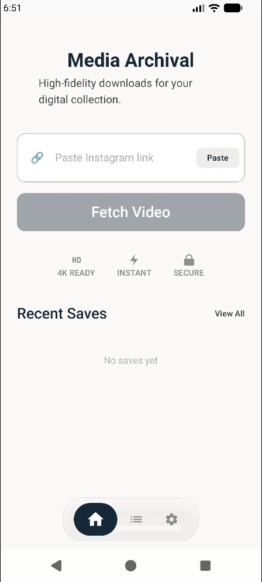
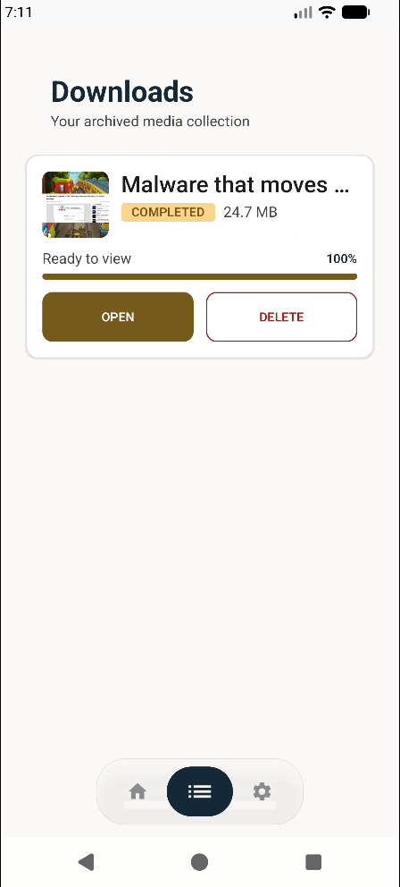
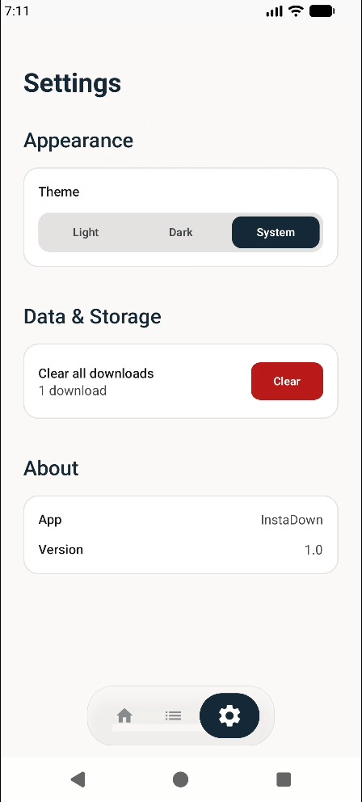
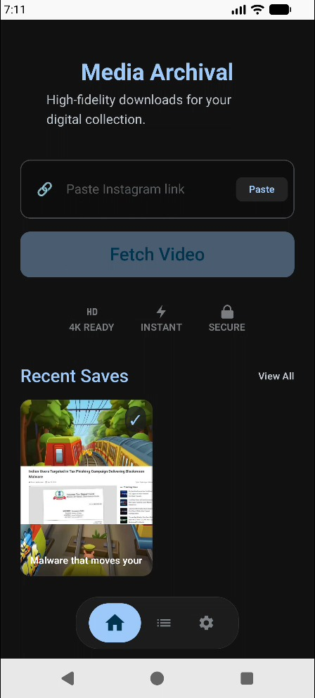

<div align="center">

# InstaDown

**High-fidelity Instagram media archiver for Android**

Paste a link, preview the media, and download reels and posts straight to your device — built with a clean, modern Material 3 interface.

[](https://www.android.com)
[](https://developer.android.com/tools/releases/platforms)
[](https://kotlinlang.org)
[](https://developer.android.com/jetpack/compose)
[](https://developer.android.com/training/dependency-injection/hilt-android)
[](https://github.com/pranavkd/InstaDown/actions/workflows/build.yml)

</div>

---

## Features

- **One-tap link paste** — grab a share link from your clipboard and fetch media instantly.
- **Live preview** — see a thumbnail, author, and type badge (Reel / Video / Post) before downloading.
- **Smart downloads** — real progress tracking with pause, resume, retry, and delete.
- **Downloads library** — a clean, card-based archive of everything you've saved, with status chips and one-tap open.
- **Light / Dark / System theme** — fluid theming that respects your device, including a smooth animated bottom navigation.
- **Local-first** — downloads and metadata persist on-device via Room.
- **Clean Architecture + MVVM** — modular, testable, and built for the future.

---

## Screenshots

| | | |
| :---: | :---: | :---: |
|  |  |  |
|  |  | |

---

## Tech Stack

| Layer | Technology |
| :--- | :--- |
| **UI** | Jetpack Compose (Material 3) |
| **Architecture** | MVVM + Clean Architecture (single module) |
| **DI** | Hilt |
| **Network** | Retrofit + OkHttp |
| **Serialization** | Kotlin Serialization |
| **Database** | Room |
| **Images** | Coil |
| **Async** | Kotlin Coroutines |
| **Language** | Kotlin (JVM 17) |
| **Min / Target SDK** | API 26 / API 36 |

---

## Getting Started

### Prerequisites

- Android Studio (latest stable, with the Android SDK)
- JDK 17
- A RapidAPI key for the Instagram downloader endpoint

### Setup

1. **Clone the repo**
   ```bash
   git clone https://github.com/pranavkd/InstaDown.git
   cd InstaDown
   ```

2. **Add your API key**

   Create a `secrets.properties` file in the project root:
   ```properties
   RAPID_API_KEY=your_api_key_here
   ```
   The key is wired into `BuildConfig` automatically (`app/build.gradle.kts`).

3. **Build & run**
   ```bash
   ./gradlew assembleDebug
   ```
   Then open the project in Android Studio and run it on an emulator or physical device (API 26+).

---

## Project Structure

```
app/src/main/java/com/pranavkd/instadown
├── data/          # Repository & API implementations, Room database
├── domain/        # Models, use cases, repository interfaces
├── presentation/
│   ├── components/  # Reusable UI (e.g. BottomNavBar)
│   ├── downloads/   # Downloads screen
│   ├── home/        # Home / fetch screen
│   ├── navigation/  # NavGraph & Screen destinations
│   └── settings/    # Settings screen
└── di/            # Hilt modules
```

---

## Contributing

Contributions are welcome! Fork the repo, create a feature branch, and open a pull request. Please keep changes consistent with the existing Clean Architecture + Compose patterns.

---

## Disclaimer

InstaDown is intended for personal, lawful archiving of content you own or have the right to download. Respect creators' rights and Instagram's Terms of Service. The developers are not responsible for misuse.

---

<div align="center">

Built with Jetpack Compose

</div>
